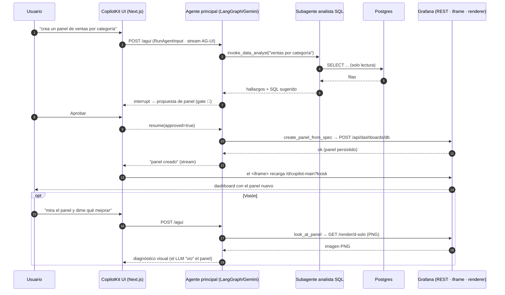
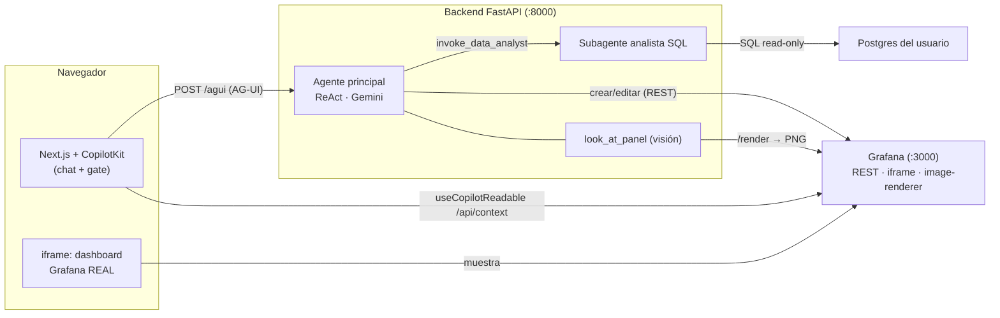

# Cómo funciona Grafana Copilot (resumen para la demo/pitch)

Resumen claro de la arquitectura y el flujo, para explicarlo con naturalidad en el video y en
la hackathon.

## En una frase
> El chat es **CopilotKit**; el dashboard es el **Grafana real embebido**. El agente crea y
> edita paneles por la **API de Grafana**, y hasta puede **ver** los paneles renderizados como
> imagen para diagnosticarlos — todo con **tu aprobación**.

## El modelo mental
- **Agente principal**: un agente **ReAct clásico** (LangGraph + Gemini) que orquesta.
- **Sus tools**:
  - `invoke_data_analyst` → **otro agente** (subagente analista) con tools para consultar la
    base de datos Postgres (solo lectura).
  - Tools que son **wrappers de la API REST de Grafana** para crear/editar/borrar paneles.
  - `look_at_panel` → **visión**: renderiza un panel a imagen para que el LLM lo "vea".
- **Las escrituras pasan por un gate**: el grafo se pausa (`interrupt`), el usuario aprueba/
  rechaza en la UI (`useLangGraphInterrupt`) y el grafo reanuda.

## Detalle importante: no es un POST simple, es streaming (AG-UI)
El frontend (`@ag-ui/client`) manda un `RunAgentInput` a `POST /agui` y el backend **devuelve un
stream de eventos AG-UI** (`RUN_STARTED`, `TEXT_MESSAGE_CONTENT`, `TOOL_CALL_*`, `RUN_FINISHED`).
CopilotKit pinta el chat con esos eventos en vivo.

## La pregunta del millón: ¿cómo se ve el panel de Grafana en la UI?
**La UI NO renderiza el panel. CopilotKit no dibuja gráficas.** El dashboard que se ve a la
izquierda es **Grafana mismo, embebido en un `<iframe>`** (en `frontend/app/page.tsx`):

```jsx
<iframe src="http://localhost:3000/d/copilot-main/...?kiosk&theme=light" />
```

Grafana renderiza sus paneles como siempre; nosotros solo lo mostramos embebido al lado del
chat. Cuando el agente crea un panel por la API REST, Grafana lo **persiste**; el iframe se
**recarga** (truco `key={ctx.panels.length}`: al cambiar el nº de paneles, React remonta el
iframe) y aparece el panel nuevo.

Para que el embebido funcione, Grafana necesita (en `docker-compose.yaml`):
- `GF_SECURITY_ALLOW_EMBEDDING=true` — permitir iframes
- `GF_AUTH_ANONYMOUS_ENABLED=true` — cargar sin login
- `?kiosk` en la URL — esconder la barra de Grafana

## Las 3 "caras" de Grafana que usa el proyecto
| Para qué | Cómo | Quién lo ve |
|---|---|---|
| **Mostrar el dashboard** en la UI | `<iframe>` a la UI de Grafana (`/d/<uid>?kiosk`) | El usuario |
| **Crear/editar paneles** + leer contexto | API REST (`/api/dashboards/db`, `/api/dashboards/uid/...`) | El agente (tools) |
| **Visión del agente** | Image-renderer (`/render/d-solo/...` → PNG) | El **LLM** (no la UI) |

Clave: la **visión** sí usa una API extra (el `grafana-image-renderer`, un contenedor aparte),
pero **no es para pintar la UI** — es para que el *agente* "vea" el panel como imagen y lo
diagnostique. Son dos renders distintos: uno para el usuario (iframe), otro para el agente (PNG).

## El contexto vivo (por qué no es un chatbox)
El frontend usa `useCopilotReadable` para empujarle al agente **qué dashboard, paneles y rango
de tiempo estás viendo ahora** (vía `/api/context`, un proxy server-side a la API de Grafana
para evitar CORS). Por eso el agente puede actuar "en contexto".

## Diagrama de secuencia — crear un panel (+ visión)



## Arquitectura (vista de componentes)



## Frases sueltas para el video
- "Los agentes salieron del chatbox: este vive **dentro de Grafana**, donde el equipo ya trabaja."
- "No reinventamos el render: embebemos el **Grafana real**; el agente escribe por su API."
- "Y va más allá de leer SQL: **ve** el panel renderizado y lo diagnostica visualmente."
- "Cada cambio pasa por tu **aprobación** — el humano siempre en el loop."
